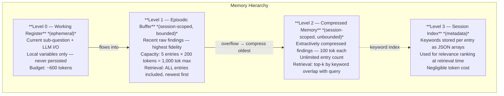
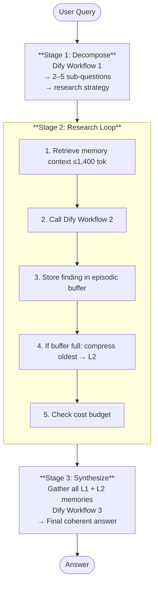

# G3: Deep Research Agent + Memory Constraints

An autonomous research agent that answers complex, multi-part queries by decomposing them into sub-questions, researching each one under strict token and cost budgets, and synthesizing a final answer from compressed memory. Built with Python, Dify + DeepSeek, SQLite, and tiktoken.

---

## Why This Architecture?

Large research queries exceed any single LLM context window or cost budget when approached naively. This agent solves that by treating research as an iterative process with *explicit memory management*: each sub-question is researched with only the relevant slice of prior findings loaded into context, and older findings are automatically compressed so the working set never exceeds a fixed token ceiling.

---

## Memory Architecture



**Constraints enforced:**

| Constraint | Limit |
|---|---|
| Per-LLM-call input tokens | ≤ 2,000 |
| Per-session total cost | ≤ $0.10 |
| Episodic buffer capacity | ≤ 5 entries |
| Episodic entry size | ≤ 200 tokens |
| Compressed entry size | ≤ 100 tokens |

---

## Pipeline



---

## Setup

### 1. Install

```bash
git clone <repo> g3-research-agent && cd g3-research-agent
python -m venv venv && source venv/bin/activate
pip install -r requirements.txt
```

### 2. Create Dify Workflows

Create three Workflow-type apps in Dify following the prompts in the "Dify Workflow Setup" section of this document. Copy each app's API key.

### 3. Configure

```bash
cp config.example.yaml config.yaml
# Edit config.yaml — fill in the three API keys
```

### 4. Run

```bash
# Interactive mode (default)
python main.py

# One-shot research
python main.py --mode research -q "What are the key differences between \
  transformer and SSM architectures, and what are the trade-offs for \
  long-context tasks?"

# List past sessions
python main.py --mode sessions
```

---

## Sample Session

```
================================================================
  RESEARCH SESSION: a3f1c9d2
  Query: How do transformer and SSM architectures compare for
         long-context NLP, and which is more cost-efficient?
  Constraints: ≤2000 tok/call, ≤$0.10/session
================================================================

📋 Stage 1: Decomposing query…
  Strategy: Compare architectures across dimensions
  Sub-questions (4):
    1. What is the core mechanism of transformer attention and its
       computational complexity?
    2. What are State Space Models (SSMs) and how do architectures
       like Mamba differ from transformers mechanistically?
    3. How do transformers and SSMs compare on long-context benchmarks
       (e.g., >8K tokens)?
    4. What are the training and inference cost profiles of each
       architecture at scale?

🔍 Stage 2: Researching sub-questions…

  [1/4] Transformer attention mechanism…
       Memory: 1/5 episodic · 0 compressed · 142 tok stored
       Cost remaining: $0.0998

  [2/4] State Space Models (SSMs)…
       Memory: 2/5 episodic · 0 compressed · 287 tok stored
       Cost remaining: $0.0996

  [3/4] Long-context benchmarks…
       Memory: 3/5 episodic · 0 compressed · 431 tok stored
       Cost remaining: $0.0993

  [4/4] Training & inference cost profiles…
       Memory: 4/5 episodic · 0 compressed · 578 tok stored
       Cost remaining: $0.0991

🧠 Stage 3: Synthesizing final answer…

================================================================
  RESEARCH COMPLETE — Session a3f1c9d2
================================================================

📊 Memory Utilisation:
   Episodic buffer:   4/5 entries (578 tok)
   Compressed memory: 0 entries (0 tok)
   Synthesis context: 578 tok used

💰 Cost:
   Input tokens:  3,847
   Output tokens: 1,203
   Total cost:    $0.000875 / $0.10 budget
```

---

## Cost Analysis

| Operation | Input tok | Output tok | Cost (DeepSeek) |
|---|---|---|---|
| Decomposition | ~450 | ~150 | ~$0.0001 |
| Per sub-question | ~800 | ~200 | ~$0.0002 |
| Synthesis | ~1,000 | ~400 | ~$0.0003 |

**Typical session (5 sub-questions):**

| Step | Cost |
|---|---|
| Decompose (×1) | $0.0001 |
| Research (×5) | $0.0010 |
| Synthesize (×1) | $0.0003 |
| **Total** | **~$0.0014** |

Budget ceiling ($0.10) allows ~70 sessions, or a single session with up to ~350 sub-questions.

---